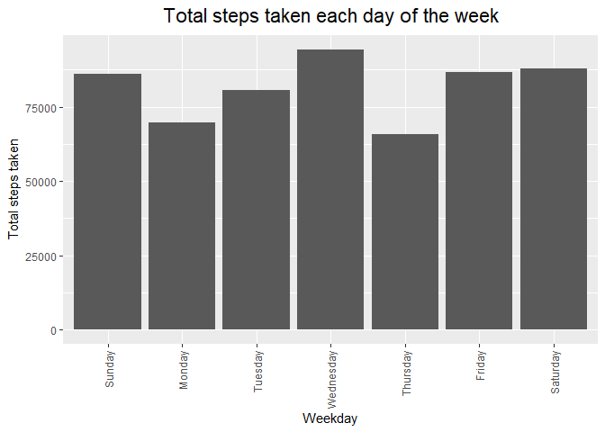
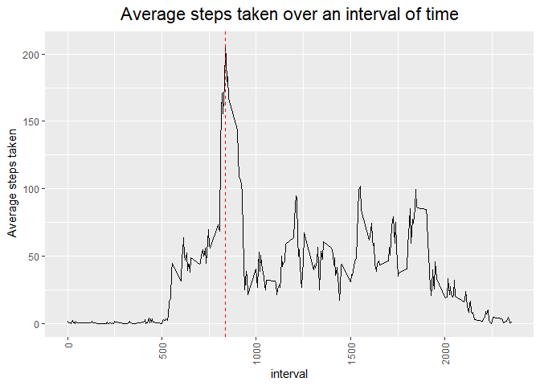
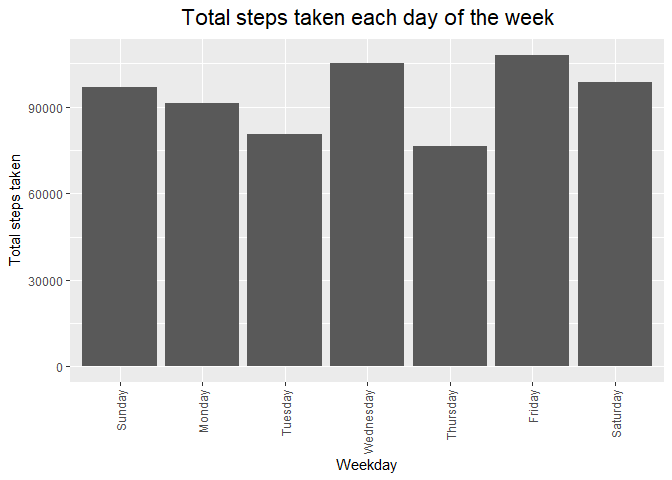
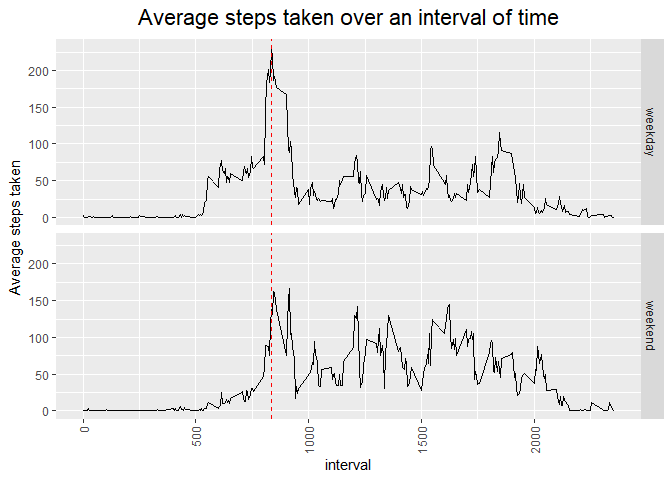

## Introduction

It is now possible to collect a large amount of data about personal movement using activity monitoring devices such as a Fitbit, Nike Fuelband, or Jawbone Up. These type of devices are part of the "quantified self" movement -- a group of enthusiasts who take measurements about themselves regularly to improve their health, to find patterns in their behavior, or because they are tech geeks. But these data remain under-utilized both because the raw data are hard to obtain and there is a lack of statistical methods and software for processing and interpreting the data.

This assignment makes use of data from a personal activity monitoring device. This device collects data at 5 minute intervals through out the day. The data consists of two months of data from an anonymous individual collected during the months of October and November, 2012 and include the number of steps taken in 5 minute intervals each day.

## Data

The data for this assignment can be downloaded from the course web site:

Dataset: [https://d396qusza40orc.cloudfront.net/repdata%2Fdata%2Factivity.zip](Activity monitoring data) [52K]
The variables included in this dataset are:

steps: Number of steps taking in a 5-minute interval (missing values are coded as NA)

date: The date on which the measurement was taken in YYYY-MM-DD format

interval: Identifier for the 5-minute interval in which measurement was taken

The dataset is stored in a comma-separated-value (CSV) file and there are a total of 17,568 observations in this dataset.

## Loading and preprocessing the data


```r
if(!file.exists("repdata_data_activity.zip")){
  download.file(
"https://d396qusza40orc.cloudfront.net/repdata%2Fdata%2Factivity.zip",
"repdata_data_activity.zip", quiet = TRUE)}

if(!file.exists("activity.csv")){
  unzip("repdata_data_activity.zip")
}

df_activity <- read.csv("activity.csv",header = TRUE)

df_activity <- df_activity %>% 
        mutate(weekday = weekdays(as.Date(df_activity$date))) %>%
        mutate(order = ifelse(weekday=="Sunday", 1,
                          ifelse(weekday=="Monday", 2,
                          ifelse(weekday=="Tuesday", 3,
                          ifelse(weekday=="Wednesday", 4,
                          ifelse(weekday=="Thursday", 5,
                          ifelse(weekday=="Friday", 6,
                          ifelse(weekday=="Saturday", 7,0
                          )))))))) %>%
        mutate(weekday = fct_reorder(weekday,order))
```


## Problem 1: What is mean total number of steps taken per day?

For this part of the assignment, you can ignore the missing values in the dataset.

1. Make a histogram of the total number of steps taken each day

2. Calculate and report the mean and median total number of steps taken per day


```r
p <- ggplot(df_activity,aes(x = weekday, y = steps)) +
        geom_histogram(stat= "identity") +
        xlab("Weekday") + 
        ylab(expression("Total steps taken")) + 
        ggtitle(expression("Total steps taken each day of the week")) +
        theme(
                axis.text.x=element_text(angle = 90, vjust = 0.5, hjust = 1), 
                plot.title = element_text(size=rel(1.5),face="bold",hjust = 0.5))
```

```
## Warning: Ignoring unknown parameters: binwidth, bins, pad
```

```r
p
```

```
## Warning: Removed 2304 rows containing missing values (position_stack).
```

<!-- -->

```r
df_activity_summary <- df_activity %>%
        group_by(weekday) %>%
        mutate(mean = round(mean(steps,na.rm = TRUE),0)) %>%
        mutate(median = median(steps, na.rm = TRUE)) %>%
        summarise(weekday,mean,median) %>%
        unique()
```

```
## `summarise()` regrouping output by 'weekday' (override with `.groups` argument)
```

```r
df_activity_summary
```

```
## # A tibble: 7 x 3
## # Groups:   weekday [7]
##   weekday    mean median
##   <fct>     <dbl>  <dbl>
## 1 Sunday       43      0
## 2 Monday       35      0
## 3 Tuesday      31      0
## 4 Wednesday    41      0
## 5 Thursday     29      0
## 6 Friday       43      0
## 7 Saturday     44      0
```

## Problem 2: What is the average daily activity pattern?

1. Make a time series plot (i.e. type = "l") of the 5-minute interval (x-axis) and the average number of steps taken, averaged across all days (y-axis)

2. Which 5-minute interval, on average across all the days in the dataset, contains the maximum number of steps?

ANSWER:  The 835 - 840 minute interval has the maximum number of steps


```r
df_activity <- df_activity %>%
  group_by(interval) %>%
  mutate(mean_interval = mean(steps,na.rm = TRUE)) %>%
  ungroup()

p <- ggplot(df_activity,aes(x = interval, y = mean_interval)) +
        geom_line(stat= "identity") +
        geom_vline(xintercept=835, linetype = "dashed", color = "red") +
        ylab(expression("Average steps taken")) + 
        ggtitle(expression("Average steps taken over an interval of time")) +
        theme(
                axis.text.x=element_text(angle = 90, vjust = 0.5, hjust = 1), 
                plot.title = element_text(size=rel(1.5),face="bold",hjust = 0.5))

p
```

<!-- -->


## Imputing missing values

Note that there are a number of days/intervals where there are missing values (coded as NA). The presence of missing days may introduce bias into some calculations or summaries of the data.

Calculate and report the total number of missing values in the dataset (i.e. the total number of rows with NAs)

Devise a strategy for filling in all of the missing values in the dataset. The strategy does not need to be sophisticated. For example, you could use the mean/median for that day, or the mean for that 5-minute interval, etc.

Create a new dataset that is equal to the original dataset but with the missing data filled in.

Make a histogram of the total number of steps taken each day and Calculate and report the mean and median total number of steps taken per day. Do these values differ from the estimates from the first part of the assignment? What is the impact of imputing missing data on the estimates of the total daily number of steps?

ANSWER:  The mean and medians did not change, but the total number of steps increased dramatically.


```r
countNAs <- sum(ifelse(rowSums(is.na(df_activity))>=1,1,0))


df_activity_complete <- df_activity

index <- is.na(df_activity_complete$steps)

df_activity_complete$steps[index] <- df_activity_complete$mean_interval[index]


df_activity_complete_summary <- df_activity_complete %>%
        group_by(weekday) %>%
        mutate(mean = round(mean(steps),0)) %>%
        mutate(median = median(steps)) %>%
        summarise(weekday,mean,median) %>%
        unique()
```

```
## `summarise()` regrouping output by 'weekday' (override with `.groups` argument)
```

```r
df_activity_complete_summary
```

```
## # A tibble: 7 x 3
## # Groups:   weekday [7]
##   weekday    mean median
##   <fct>     <dbl>  <dbl>
## 1 Sunday       42      0
## 2 Monday       35      0
## 3 Tuesday      31      0
## 4 Wednesday    41      0
## 5 Thursday     30      0
## 6 Friday       42      0
## 7 Saturday     43      0
```

```r
p <- ggplot(df_activity_complete,aes(x = weekday, y = steps)) +
        geom_histogram(stat= "identity") +
        xlab("Weekday") + 
        ylab(expression("Total steps taken")) + 
        ggtitle(expression("Total steps taken each day of the week")) +
        theme(
                axis.text.x=element_text(angle = 90, vjust = 0.5, hjust = 1), 
                plot.title = element_text(size=rel(1.5),face="bold",hjust = 0.5))
```

```
## Warning: Ignoring unknown parameters: binwidth, bins, pad
```

```r
p
```

<!-- -->

## Are there differences in activity patterns between weekdays and weekends?


```r
df_activity_complete_p4 <- df_activity_complete %>%
        mutate(difference = ifelse((weekday == "Saturday" | weekday == "Sunday"),"weekend","weekday")) %>%
        group_by(difference,interval) %>%
        mutate(difference_mean = mean(steps))
        
p <- ggplot(df_activity_complete_p4,aes(x = interval, y = difference_mean)) +
        facet_grid(difference ~ .) +
        geom_line(stat= "identity") +
        geom_vline(xintercept=835, linetype = "dashed", color = "red") +
        ylab(expression("Average steps taken")) + 
        ggtitle(expression("Average steps taken over an interval of time")) +
        theme(
                axis.text.x=element_text(angle = 90, vjust = 0.5, hjust = 1), 
                plot.title = element_text(size=rel(1.5),face="bold",hjust = 0.5))

p
```

<!-- -->
